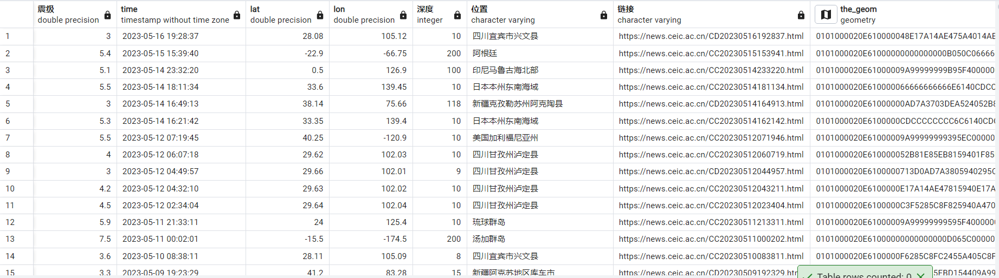
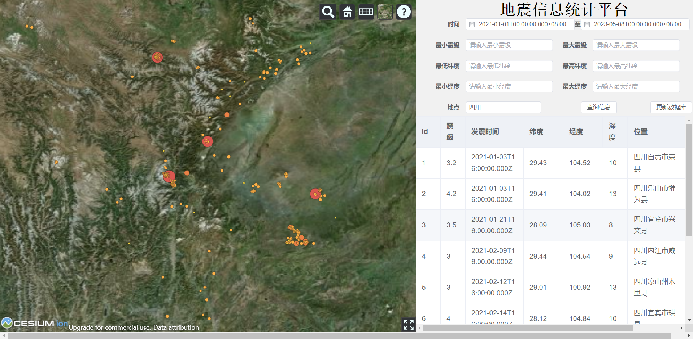

# 地震可视化系统
大作业项目：基于WebGIS实现的对中国地震台网收录的地震信息进行可视化展示系统

## 演示视频
演示视频可在b站查看：https://www.bilibili.com/video/BV1353yeaENo/

## 小组成员
xxx  xxx  xxx

## 内容
  * 三维地震点展示（震级大小不同，显示的地震点大小、颜色也不同；鼠标悬浮某地震点上，该地震点高亮显示）
  * 根据发震时间、震级大小、经纬度范围、发震地点查询地震数据。
  * 根据用户需要更新数据库（需要配置back-end/updateData.py所需要的python环境和第三方库：datetime、requests、pandas、psycopg2）
  
## 前端
  * 使用VUE框架、element-ui组件库
  * 三维地图部分使用Cesium

## 后端
 * 使用NodeJS，express框架
 * 使用PostGIS数据库用于地震点数据存储
 * 使用Python进行地震点数据的爬取

## 环境配置
  * 后端：查看back-end文件夹中的"服务器配置.txt"文件对后端进行配置
  * 数据库：如果不进行Python环境配置，可以查看data文件夹中的"读取到数据库”指南对数据库进行配置，数据库样式大致如下
  * 前端：在后端和数据库都配置完成情况下，在cesium_vue中使用npm run serve即可启动，界面大致如下。

